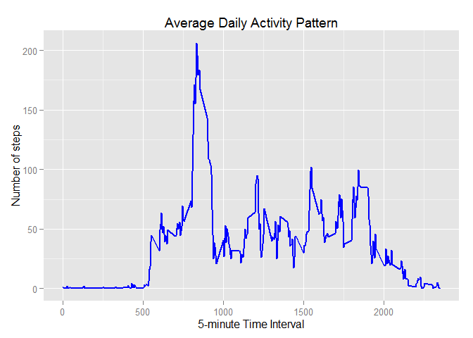

# Reproducible Research: Peer Assessment 1


Reproducible Research Project 1
=================================

This is the first project of the Reproducible Research course on Data Science specialization. The objective is to analyze data about personal movement using activity monitoring device.

## Loading and preprocessing the data

###Download, unzip, and load data


```r
if(!file.exists("repdata-data-activity.zip")) {
        temp <- tempfile()
        download.file("http://d396qusza40orc.cloudfront.net/repdata%2Fdata%2Factivity.zip",temp)
        unzip(temp)
        unlink(temp)
}

data <- read.csv("activity.csv")
```

###Preprocess the data by converting date to date class and interval to factor class


```r
data$date <- as.Date(data$date, format = "%Y-%m-%d")
data$interval <- as.factor(data$interval)
```

##What is the mean total number of steps taken per day?

###1. Calculate the total number of steps taken per day


```r
TotalStepsPerDay <- aggregate(steps ~ date, data, sum)
```

###2. Make a histogram of the total number of steps taken each day


```r
hist(TotalStepsPerDay$steps, main = paste("Total Number of Steps Taken Per Day"), breaks=10, col="grey", xlab="Total Number of Steps")
```

 

###3. Calculate and report the mean and median of the total number of steps taken per day


```r
Mean <- mean(TotalStepsPerDay$steps)
Mean
```

```
## [1] 10766.19
```

```r
Median <- median(TotalStepsPerDay$steps)
Median
```

```
## [1] 10765
```

##What is the average daily activity pattern?

###1. Make a time series plot (i.e. type = "l" ) of the 5minute interval (xaxis) and the average number of steps taken, averaged across all days (yaxis)


```r
StepsPerInterval <- aggregate(data$steps, by = list(interval = data$interval), FUN=mean, na.rm=TRUE)
StepsPerInterval$interval <- as.integer(levels(StepsPerInterval$interval)[StepsPerInterval$interval])
colnames(StepsPerInterval) <- c("interval", "steps")

library(ggplot2)
ggplot(StepsPerInterval, aes(x=interval, y=steps)) +   
        geom_line(color="blue", size=1) +  
        labs(title="Average Daily Activity Pattern", x="5-minute Time Interval", y="Number of steps")
```

 

###2. Which 5-minute interval, on average across all the days in the dataset, contains the maximum number of steps?


```r
MaxInterval <- StepsPerInterval[which.max(StepsPerInterval$steps),]
MaxInterval
```

```
##     interval    steps
## 104      835 206.1698
```

*The maximum steps taken (206.17) were at the 5-minute time interval starting at 8:35.*

##Impute missing values

###1. Calculate and report the missing values


```r
missing <- sum(is.na(data$steps))
missing
```

```
## [1] 2304
```

###2 & 3. New dataset with missing values filled with mean number of steps for each interval (calculated ealier)


```r
ImputedData <- transform(data, steps = ifelse(is.na(data$steps), 
  StepsPerInterval$steps[match(data$interval, StepsPerInterval$interval)], data$steps))
```

###4. Make a histogram of the total number of steps taken each day


```r
StepsPerDayImputed <- aggregate(steps ~ date, ImputedData, sum)
hist(StepsPerDayImputed$steps, main = paste("Total Number of Steps Taken Per Day"), breaks=10, col="grey", xlab="Total Number of Steps")
```

 

###Calculate and report new mean and median for the imputed data.


```r
MeanImputed <- mean(StepsPerDayImputed$steps)
MeanImputed
```

```
## [1] 10766.19
```

```r
MedianImputed <- median(StepsPerDayImputed$steps)
MedianImputed
```

```
## [1] 10766.19
```

###Calculate the difference between imputed and non-imputed data.


```r
MeanDiff <- MeanImputed - Mean
MeanDiff
```

```
## [1] 0
```

```r
MedianDiff <- MedianImputed - Median
MedianDiff
```

```
## [1] 1.188679
```

###Impact of imputing missing data on the estimates of the total daily number of steps.


```r
TotalStepsDiff <- sum(StepsPerDayImputed$steps) - sum(TotalStepsPerDay$steps)
TotalStepsDiff
```

```
## [1] 86129.51
```

##Are there differences in activity patterns between weekdays and weekends?

###1. Create a new variable to differentiate weeekdays and weekends.


```r
Weekdays <- c("Monday", "Tuesday", "Wednesday", "Thursday", "Friday")
ImputedData$dow = as.factor(ifelse(is.element(weekdays(as.Date(ImputedData$date)),Weekdays), "Weekday", "Weekend"))

StepsWkDayWkEndImputed <- aggregate(steps~interval+dow, ImputedData, mean)
```

###2. Create panel plot for steps by 5-minute interval for weekdays and weekends


```r
library(lattice)
xyplot(StepsWkDayWkEndImputed$steps ~ StepsWkDayWkEndImputed$interval|StepsWkDayWkEndImputed$dow, 
  main="Average Steps per Day by 5-minute Interval",xlab="5-minute Time Interval", ylab="Total Number of Steps",layout=c(1,2), col="blue", type="l")
```

 
  
